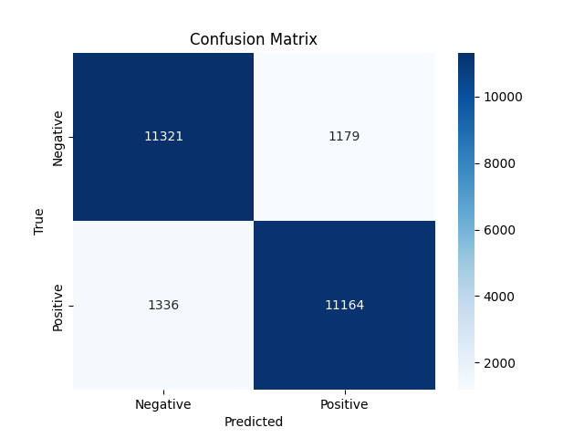
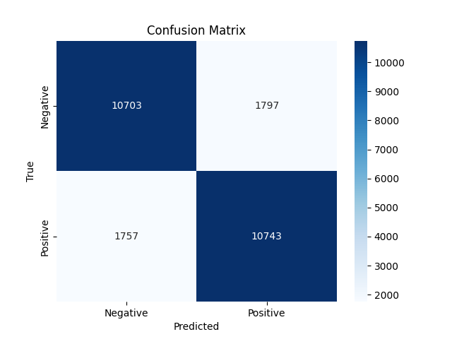
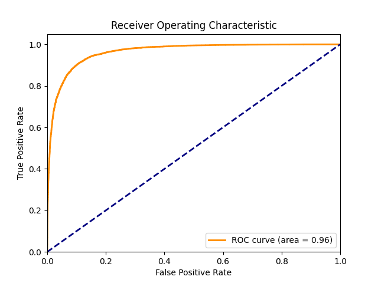
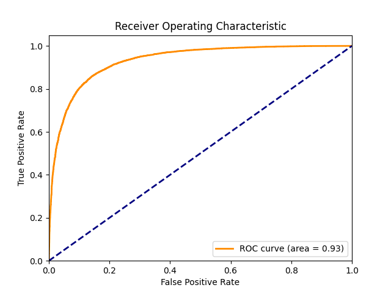

# Sentiment Classification on IMDb Dataset

This project involves sentiment classification on the IMDb dataset using two different models: an LSTM and a simple Transformer. The goal is to classify movie reviews as positive or negative.

## Models

### LSTM
- **Accuracy**: 90% after 10 epochs

### Transformer
- **Accuracy**: 80% after 20 epochs

## Results

| LSTM Confusion Matrix | Transformer Confusion Matrix |
|-----------------------|------------------------------|
|  |  |

| LSTM ROC Curve | Transformer ROC Curve |
|----------------|-----------------------|
|  |  |

## Dependencies

The project uses the following libraries:
- `torch`
- `torchvision`
- `torchtext`
- `numpy`
- `matplotlib`
- `sklearn`

## Installation

To install the required dependencies, run:
```sh
pip install -f requirements.txt
```
## Usage
1. To choose model, see the config
2. Train
```sh
python train.py
```
3. Evaluate/visualize
```sh
python evaluation.py
```